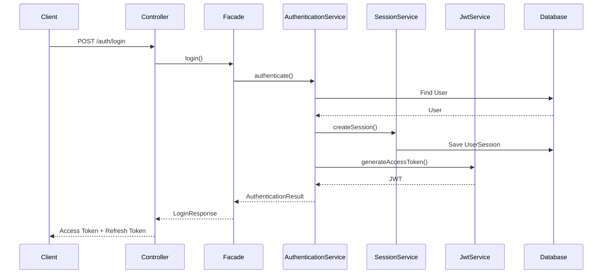

# Authentication Flow

```mermaid
sequenceDiagram

participant Client

participant Controller

participant Facade

participant AuthenticationService

participant SessionService

participant JwtService

participant Database

Client->>Controller: POST /auth/login

Controller->>Facade: login()

Facade->>AuthenticationService: authenticate()

AuthenticationService->>Database: Find User

Database-->>AuthenticationService: User

AuthenticationService->>SessionService: createSession()

SessionService->>Database: Save UserSession

AuthenticationService->>JwtService: generateAccessToken()

JwtService-->>AuthenticationService: JWT

AuthenticationService-->>Facade: AuthenticationResult

Facade-->>Controller: LoginResponse

Controller-->>Client: Access Token + Refresh Token
```

## Description

The authentication process verifies credentials, creates a persistent session, generates an access token, and returns both tokens to the client.
