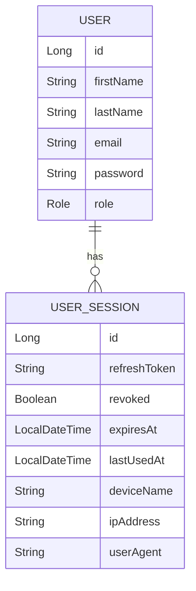

# Entity Relationships

## Description

A user can have multiple active sessions, allowing authentication from multiple devices simultaneously. Each session stores refresh token information and metadata to support secure session management.
