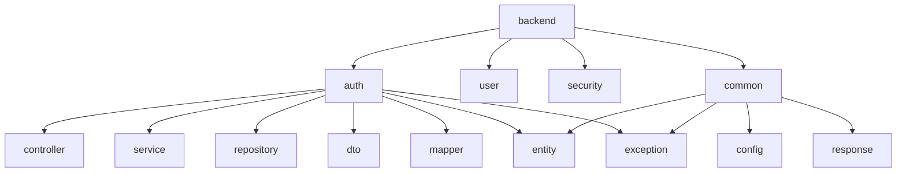

# Package Structure

```mermaid
flowchart TD

backend

backend --> auth

backend --> user

backend --> security

backend --> common

auth --> controller

auth --> service

auth --> repository

auth --> dto

auth --> mapper

auth --> entity

auth --> exception

common --> config

common --> entity

common --> response

common --> exception
```

## Description

The project follows a package-by-feature approach. Each feature owns its controllers, services, repositories, DTOs, entities, mappers, and exceptions.
