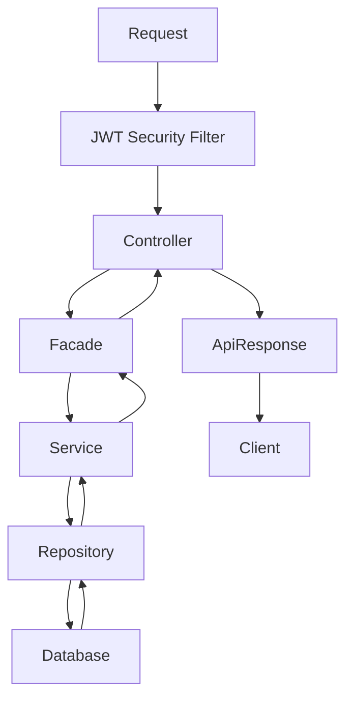

# Request Lifecycle

```mermaid
flowchart TD

Request --> SecurityFilter["JWT Security Filter"]
SecurityFilter --> Controller
Controller --> Facade
Facade --> Service
Service --> Repository
Repository --> Database
Database --> Repository
Repository --> Service
Service --> Facade
Facade --> Controller
Controller --> ApiResponse
ApiResponse --> Client
```

## Description

Every request passes through the security layer before reaching the business layers. Responses are wrapped using the standard API response structure.
