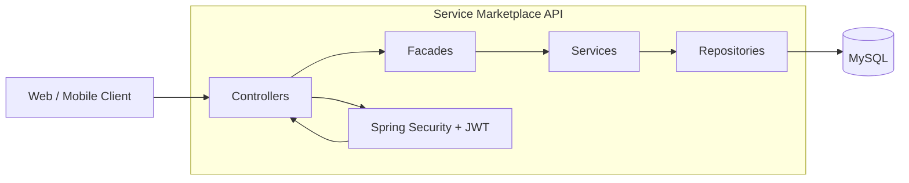

# System Overview

## Description

The application follows a layered architecture.

* Controllers expose REST endpoints.
* Facades orchestrate business workflows.
* Services contain business logic.
* Repositories handle persistence.
* Spring Security validates authentication and authorization.
* MySQL stores application data.
